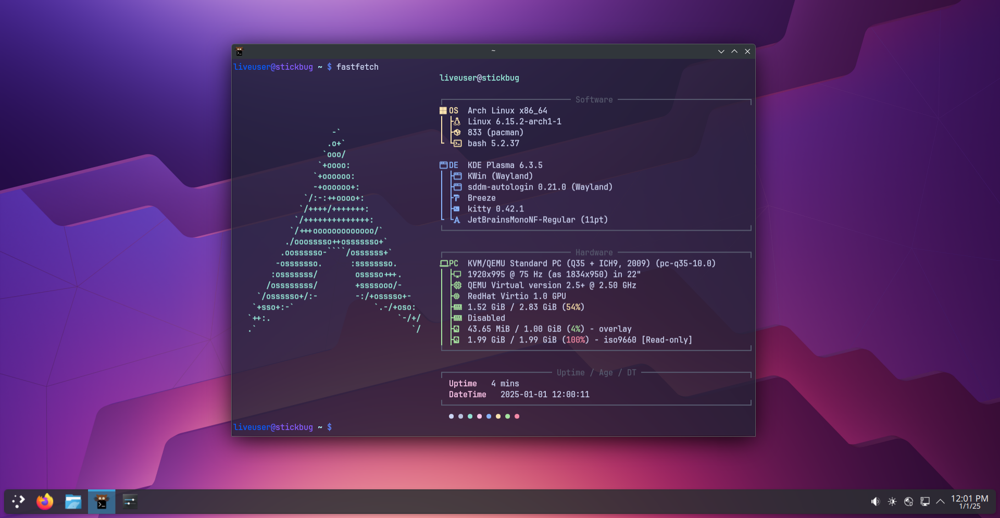

# Stickbug

A custom [Arch Linux](https://archlinux.org/) ISO with [KDE Plasma](https://kde.org/plasma-desktop/) for personal use.



## Features

- Suitable as a rescue ISO
- Lightweight, only 2GB in size
- _I use arch btw_

Extra packages included:

- Minimal [KDE Plasma 6](https://kde.org/plasma-desktop/) + [SDDM](https://github.com/sddm/sddm)
- [Breeze Dark theme](https://archlinux.org/packages/extra/x86_64/breeze/)
- [Kitty terminal](https://github.com/kovidgoyal/kitty)
- [Firefox](https://www.mozilla.org/en-US/firefox/new/)
- [GParted](https://gparted.org)
- [fastfetch](https://github.com/fastfetch-cli/fastfetch)
- [gdu](https://github.com/dundee/gdu)

## Requirements

### Building

- [`archiso`](https://wiki.archlinux.org/title/Archiso#Installation)

### Testing

- [QEMU](https://wiki.archlinux.org/title/QEMU#Installation) for virtualization
- [`edk2-ovmf`](https://archlinux.org/packages/extra/any/edk2-ovmf/) for UEFI testing

## Building your ISO

Run

```sh
$ ./build.sh
```

The generated ISO file is located at `out/stickbug-*.iso`.

**Note:**
You may also need to execute [`services.sh`](./services.sh) _before_ building to create symlinks that enables systemd services on startup.
Please refer to the [ArchWiki article](https://wiki.archlinux.org/title/Archiso#systemd_units) for more information.

```sh
$ ./services.sh
```

## Testing your ISO

Run

```sh
$ ./test-vm.sh
```

## Using your ISO

Burn the generated ISO file in `out/stickbug-*.iso` to a USB stick ([ArchWiki article](https://wiki.archlinux.org/title/USB_flash_installation_medium)). Personally I use [Ventoy](https://www.ventoy.net/en/index.html).

When you boot it, you can use GParted to fix partitions and Firefox to watch cat videos on the internet.

You can also use Kitty terminal and follow the [Installation Guide](https://wiki.archlinux.org/title/Installation_guide) to install ArchLinux on a new machine.

## To do

- Use Layan dark theme + Tela icons
- Add AUR packages (https://bbs.archlinux.org/viewtopic.php?pid=2006294#p2006294)
  - yay
  - ble.sh

## FAQ

### Why?

I wanted a Arch Linux rescue ISO that has GParted and a web browser. Everything else was just extra :3

### Stickbug?

It's supposed to be bootable from a USB stick and feels buggy. USB stick...bug, Stickbug!

## Acknowledgements

- https://wiki.archlinux.org/title/Archiso
- https://gitlab.archlinux.org/archlinux/archiso
- https://gitlab.archlinux.org/archlinux/archiso/-/blob/master/docs/README.profile.rst
- https://github.com/arch-linux-gui/alg-plasma-pure
- https://github.com/gsanhueza/ArchISOMaker
